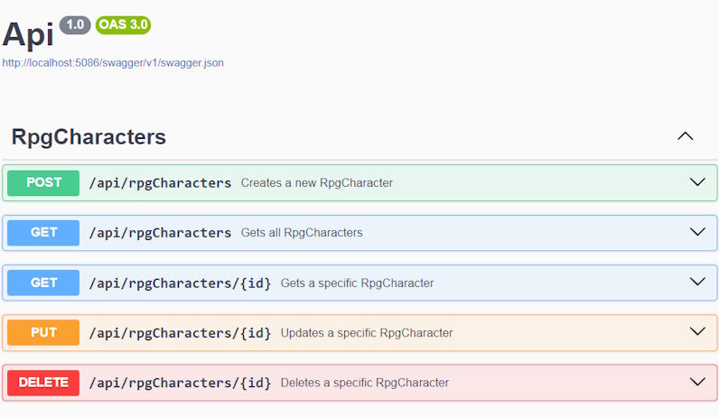

# MinimalApiWithEFCoreAndSQLite
Minimal API with EntityFramework Core and SQLite

### CRUD operations
- **POST** /api/rpgCharacters
  Creates a new RpgCharacter
- **GET** /api/rpgCharacters
  Gets all RpgCharacters
- **GET** /api/rpgCharacters/{id}
  Gets a specific RpgCharacter
- **PUT** /api/rpgCharacters/{id}
  Updates a specific RpgCharacter
- **DELETE** /api/rpgCharacters/{id}
  Deletes a specific RpgCharacter



### How to start the REST API

- Download and install [.NET 8.0 SDK](https://dotnet.microsoft.com/en-us/download/dotnet/8.0)
- Running the API project from the command line
```
dotnet run --project .\Api
```
- Open the API documentation in your browser
```
http://localhost:5086/swagger
```
- Database and all migrations will be created when the application is launched

### Technologies
List of technologies, frameworks and libraries used for implementation:
- [.NET 8.0](https://dotnet.microsoft.com/en-us/download/dotnet/8.0) (platform)
- [SQLite](https://www.sqlite.org/) (database)
- [EF Core 8](https://learn.microsoft.com/en-us/ef/core/) (ORM)